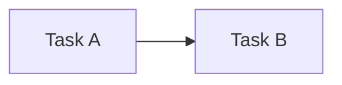
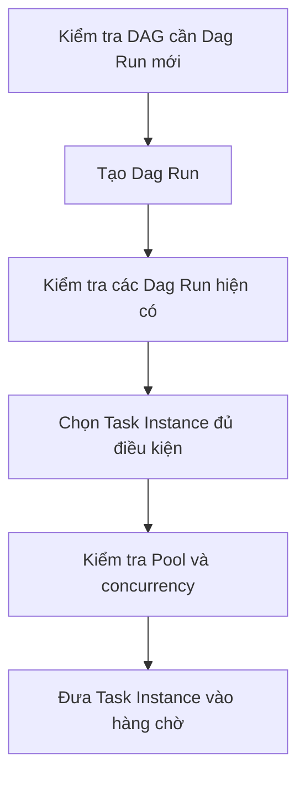
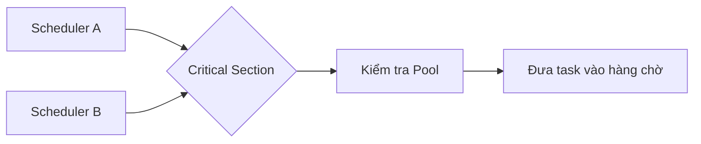
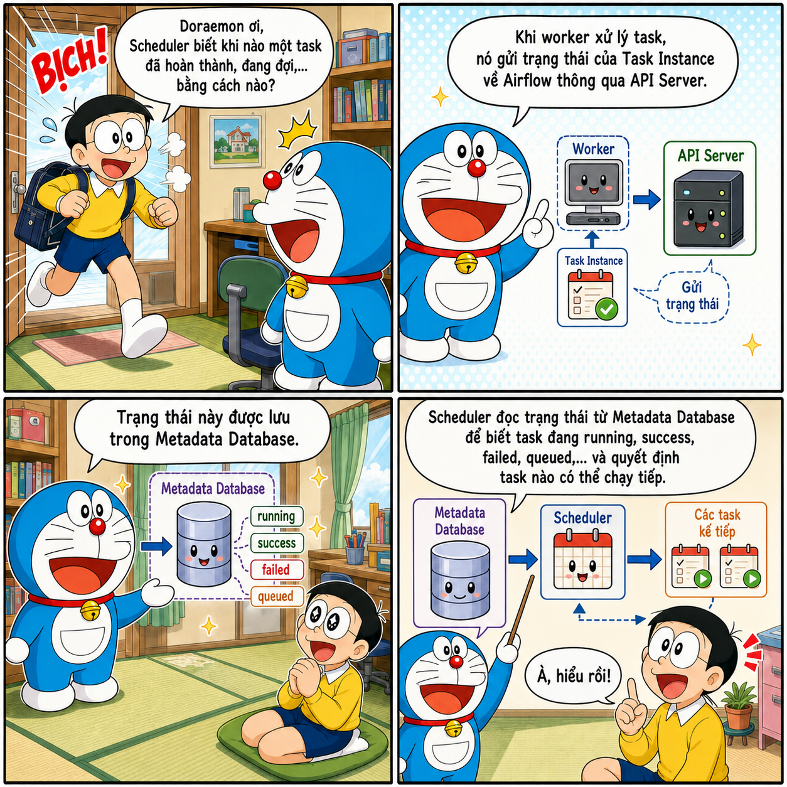
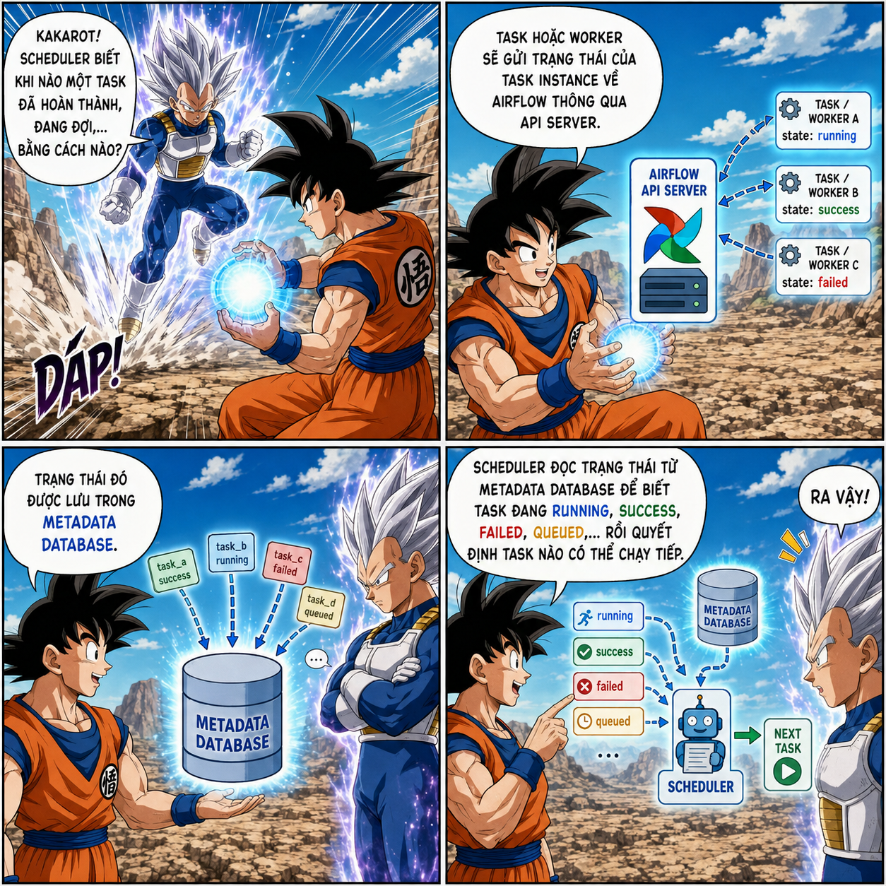
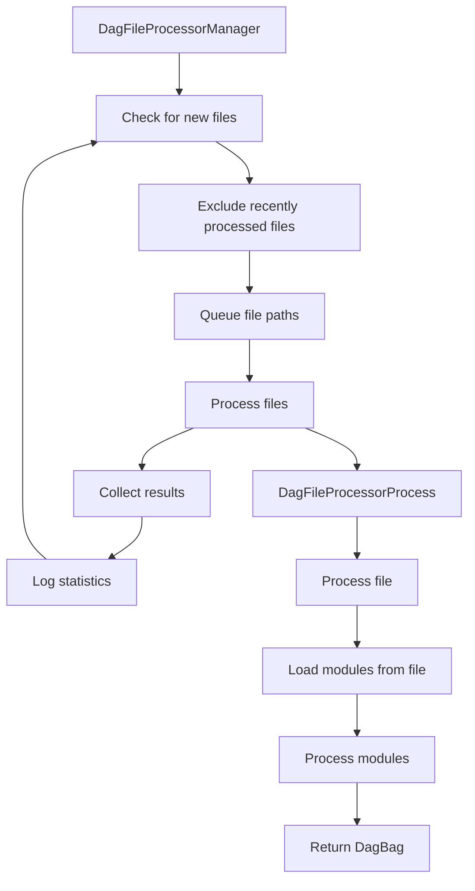

---
hide:
  - navigation
---

<header class="airflow-article-hero">
  <div class="airflow-article-hero__eyebrow">
    <a href="../../">DATA ENGINEERING FIELD NOTES</a>
    <span>ARTICLE / 001</span>
  </div>
  <h1>Kiến trúc<br><em>Apache Airflow</em></h1>
  <p class="airflow-article-hero__dek">
    Đi từ một pipeline Bash và Cron đơn giản đến cách Scheduler, Executor,
    HA Scheduler và Critical Section phối hợp để điều phối workflow ở quy mô lớn.
  </p>
  <div class="airflow-article-hero__meta" aria-label="Thông tin bài viết">
    <span>ORCHESTRATION</span>
    <span>LONG READ</span>
    <span>EDITION 01 · 2026</span>
  </div>
</header>

<figure class="airflow-opening-comic">
  
  <figcaption>
    <span>LƯU Ý TRƯỚC KHI ĐỌC</span>
    <strong>Một bài viết khá dài</strong>
  </figcaption>
</figure>

## Tại sao cần Airflow?

Bạn đã bao giờ tự hỏi tại sao chúng ta cần Airflow chưa? Nếu mục tiêu chỉ là điều phối các chương trình chạy tuần tự, một file Bash (`.sh`) hoàn toàn có thể đáp ứng. Khi cần chạy theo lịch, ta còn có thể kết hợp Bash với Cron.

### Điều phối tuần tự bằng Bash

Ví dụ, file `pipeline.sh` dưới đây lần lượt chạy hai task:

```bash
#!/usr/bin/env bash
set -e

echo "Bắt đầu task 1"
python3 /path/to/task_1.py

echo "Task 1 xong, bắt đầu task 2"
python3 /path/to/task_2.py

echo "Pipeline hoàn tất"
```

Cấp quyền thực thi cho file:

```bash
chmod +x /path/to/pipeline.sh
```

Sau đó, mở cấu hình Cron:

```bash
crontab -e
```

Thêm lịch chạy pipeline vào 02:00 mỗi ngày:

```cron
0 2 * * * /path/to/pipeline.sh >> /path/to/pipeline.log 2>&1
```

### Vì sao không chỉ dùng Bash?

Liệu chúng ta có thể thay Airflow bằng các file Bash như trên để tiết kiệm tài nguyên không? Câu trả lời là **không**.

Bash phù hợp khi hệ thống chỉ có một vài luồng xử lý cơ bản và dependency chưa quá phức tạp. Tuy nhiên, khi workflow phát triển lên hàng trăm task, các dependency cũng trở nên khó quản lý hơn. Giả sử pipeline đã hoàn thành 99% nhưng task cuối cùng bị lỗi: với Bash, bạn phải tự viết checkpoint, tách task thành những script riêng hoặc bổ sung cơ chế retry cho task đó.

Bash không cung cấp sẵn cơ chế retry/rerun theo từng task, khả năng lưu trạng thái hay giao diện vận hành. Nếu phải tự xây dựng tất cả những khả năng này, hệ thống sẽ nhanh chóng trở nên phức tạp.

### Airflow giải quyết điều gì?

Trong trường hợp này, Airflow trở thành một lựa chọn phù hợp với những khả năng như:

- UI giúp quan sát workflow trực quan hơn;
- retry cho từng task;
- lưu lại lịch sử chạy mà không phải tự xây dựng cấu hình phức tạp như khi dùng Bash;
- backfill để chạy lại một workflow trong quá khứ.

Airflow mang lại nhiều khả năng mạnh mẽ. Tuy nhiên, để khai thác tốt những khả năng đó, chúng ta cần hiểu rõ kiến trúc và cơ chế vận hành của nó. Bài viết này sẽ đi sâu vào Airflow, giúp bạn sử dụng công cụ một cách chủ động thay vì chỉ vận hành nó một cách mơ hồ.

---

## Những khái niệm nền tảng

Trước khi tìm hiểu kiến trúc Airflow, bạn cần nắm được năm khái niệm sau:

| Khái niệm | Ý nghĩa |
| --- | --- |
| **DAG** (`Directed Acyclic Graph`) | Trong tiếng Việt, DAG có nghĩa là **đồ thị có hướng không chu trình**. “Có hướng” nghĩa là mỗi cạnh biểu diễn quan hệ phụ thuộc theo một hướng, chẳng hạn `A → B`. “Không chu trình” nghĩa là không thể đi theo các cạnh rồi quay lại task ban đầu. |
| **Task** | Một nút trong DAG và là đơn vị công việc cơ bản của Airflow. Task thường được tạo từ `Operator`, `Sensor` hoặc một hàm được trang trí bằng `@task`. |
| **Task Instance** | Một task cụ thể trong một lần chạy DAG. Ví dụ, task A chạy ngày 21 là một Task Instance của ngày 21; khi chạy ngày 22, nó tạo ra một Task Instance khác. Scheduler chủ yếu làm việc với Task Instance thay vì định nghĩa Task. |
| **Schedule** | Cấu hình lịch chạy cho DAG. Khi đến thời điểm đã định, Airflow tự động kích hoạt DAG. Schedule có thể được cấu hình bằng Cron, các preset như `@daily` hoặc `timedelta`. |
| **Dependency** | Mối quan hệ giữa các task, đồng thời thể hiện điều kiện để task được chạy. Ví dụ, task A phải chạy trước task B. |

Ví dụ dependency đơn giản giữa hai task:



---

## Các component trong Airflow

### Các component bắt buộc

#### Scheduler

Scheduler theo dõi các DAG và Dag Run, tạo Dag Run theo lịch, xác định những Task Instance đã thỏa mãn dependency và các giới hạn concurrency, sau đó gửi chúng tới Executor để thực thi.

##### Quá trình phân tích DAG

Trong Airflow 2.x, Scheduler có một tiến trình con nội bộ tên là `DagFileProcessorManager`, được dùng để phân tích cú pháp các file trong DAG folder. Những tiến trình này ghi nhận trạng thái của file DAG vào metadata database; nếu quá trình phân tích gặp lỗi, thông tin lỗi sẽ được hiển thị trên UI.

Từ phiên bản 2.3, `DagFileProcessorManager` đã có thể được cấu hình để chạy độc lập. Từ Airflow 3, tiến trình này trở thành một component bắt buộc và luôn chạy tách biệt với Scheduler. Việc phân tách giúp tăng cường bảo mật, đồng thời hạn chế tình trạng quá trình parse các file DAG nặng làm nghẽn Scheduler.

> **Lưu ý về lịch `@daily`**
>
> Với lịch `@daily`, Dag Run xử lý data interval của ngày 1/1 thường được tạo sau khi khoảng dữ liệu đó kết thúc, tức là vào hoặc ngay sau 00:00 ngày 2/1 theo múi giờ của DAG. Cách vận hành này giúp khoảng dữ liệu cần xử lý được thu thập đầy đủ.

##### HA Scheduler

Khi hệ thống có quá nhiều DAG, với số lượng lên đến hàng trăm hoặc hàng nghìn task, một Scheduler có thể mất nhiều thời gian để hoàn thành một scheduling loop. Đây là lúc **HA Scheduler** trở nên hữu ích.

HA Scheduler cho phép chạy nhiều Scheduler cùng lúc. Tất cả Scheduler đều ở trạng thái active, thay vì một Scheduler active và một Scheduler pending. Mô hình này giúp chia tải điều phối; nếu một Scheduler gặp sự cố, những Scheduler còn lại có thể tiếp tục xử lý công việc.

Tuy nhiên, việc nhiều Scheduler chạy song song có thể dẫn tới xử lý trùng lặp. Chẳng hạn, Scheduler 1 và Scheduler 2 có thể cùng chọn một Dag Run để xử lý. Vì vậy, Airflow cần sử dụng cơ chế row-level lock của database.

Một scheduling loop gồm ba bước chính:

1. Kiểm tra DAG nào cần tạo Dag Run mới và tạo Dag Run tương ứng.
2. Kiểm tra các Dag Run hiện có để tìm Task Instance có thể bắt đầu được lập lịch, hoặc đánh dấu Dag Run đã hoàn tất.
3. Chọn các Task Instance đủ điều kiện để đưa vào lịch thực thi, đồng thời bảo đảm tuân theo giới hạn của Pool.



##### Critical Section

Trong scheduling loop có một bước được gọi là **Critical Section**. Tại một thời điểm, chỉ một Scheduler được phép đi vào khu vực này. Các Scheduler khác vẫn hoạt động và có thể tiếp tục thực hiện những phần khác của scheduling loop.

Critical Section kiểm tra Pool, xác định các task có thể thực thi và đưa chúng vào hàng chờ. Cơ chế này ngăn chặn tình huống:

1. Scheduler A thấy Pool còn hai slot và đưa hai task vào hàng chờ.
2. Scheduler B cũng thấy Pool còn hai slot và tiếp tục đưa thêm hai task vào hàng chờ.
3. Kết quả là có tổng cộng bốn task được xếp hàng, vượt quá giới hạn hai slot của Pool.



##### Khả năng mở rộng và nút thắt

Khi Scheduler bị giới hạn bởi CPU, việc thêm Scheduler thứ hai hoặc thứ ba thường giúp năng lực điều phối tăng gần tuyến tính. Tuy nhiên, mức tăng này không được bảo đảm nếu metadata database, mạng hoặc tài nguyên dùng chung đã trở thành nút thắt.

Một bottleneck phổ biến của Scheduler xuất hiện khi hệ thống có quá nhiều DAG và task. Scheduler phải liên tục truy cập database để lấy thông tin; nếu database không đủ khả năng đáp ứng, hiệu suất điều phối sẽ bị ảnh hưởng đáng kể.

#### Executor

Executor là một thuộc tính cấu hình của Scheduler, không phải một component tách rời. Executor chạy ngay bên trong tiến trình Scheduler. Nếu Scheduler có nhiệm vụ lên lịch và xác định khi nào một task sẵn sàng chạy, Executor chịu trách nhiệm đưa task đến môi trường thực thi phù hợp. Tùy theo loại Executor, task có thể chạy cục bộ hoặc từ xa trên worker hay pod.

Executor có thể được chia thành hai nhóm: LocalExecutor và Remote Executor.

##### LocalExecutor

LocalExecutor là cấu hình mặc định của Airflow. Khi Scheduler giao việc, LocalExecutor tạo các tiến trình con của tiến trình Scheduler để thực thi tác vụ.

Ví dụ, một task cần xử lý file 5 GB. Vì LocalExecutor nằm trong tiến trình của Scheduler, task sẽ sử dụng tài nguyên tính toán của máy chủ chạy Scheduler. Điều này có thể khiến task chiếm CPU và RAM của máy, làm Scheduler thiếu tài nguyên để quét DAG hoặc lên lịch cho các task khác.

Đổi lại, LocalExecutor có cấu hình tương đối đơn giản và độ trễ thấp vì task được chạy trên cùng node với Scheduler.

##### Remote Executor

Remote Executor có thể được chia thành hai loại:

1. **Queue/Batch Executor**, ví dụ như CeleryExecutor: Executor trong Scheduler gửi task vào một hàng đợi trung tâm, chẳng hạn Message Queue sử dụng Redis. Các worker trên những máy chủ từ xa sẽ pull task về và thực thi. Những worker này thường hoạt động liên tục, nhờ đó giảm độ trễ khi khởi động task.

    Lợi ích của mô hình này là worker không còn tranh giành tài nguyên với Scheduler. Hệ thống chạy worker cũng có thể mạnh hơn nhiều so với việc gom các worker trên một máy duy nhất.

    Hạn chế là một máy chủ worker sẽ xử lý nhiều tác vụ. Nếu một số tác vụ xung đột phiên bản thư viện hoặc cạnh tranh tài nguyên, chúng có thể ảnh hưởng đến các tác vụ khác. Tình trạng này được gọi là *noisy neighbor*. Ngoài ra, do các worker luôn được bật, những khoảng thời gian không có việc sẽ gây lãng phí tài nguyên. Đây là lúc Containerized Executor phát huy tác dụng.

2. **Containerized Executor**, ví dụ như KubernetesExecutor: Để khắc phục những nhược điểm của Queue/Batch Executor, Containerized Executor chạy mỗi task trong một container hoặc pod riêng. Mỗi container có một môi trường độc lập nên tránh được tình trạng *noisy neighbor*.

    Loại Executor này phát huy ưu điểm đối với những tác vụ nặng, chạy theo đợt dài hoặc không thường xuyên, vì container chỉ được khởi động khi có task cần thực thi. Tuy nhiên, nó cũng có những nhược điểm sau:

    - Có độ trễ do phải chờ container khởi động.
    - Có thể tốn kém đối với những task được thực thi thường xuyên vì phải liên tục tạo pod hoặc container.

Kể từ Airflow 2.10.0, Airflow hỗ trợ cấu hình nhiều Executor đồng thời. Vì mỗi loại có ưu và nhược điểm khác nhau, ta có thể chỉ định Executor phù hợp cho từng tác vụ cụ thể.

##### Cấu hình Executor

Để ghi đè Executor mặc định, cấu hình `airflow.cfg` như sau:

```ini
[core]
executor = LocalExecutor
```

Bạn cũng có thể sử dụng biến môi trường:

```bash
export AIRFLOW__CORE__EXECUTOR="LocalExecutor"
```

Để kiểm tra Executor hiện tại, chạy lệnh:

```bash
airflow config get-value core executor
```

Để chạy nhiều Executor đồng thời, sử dụng một trong hai cách sau:

```ini
[core]
executor = LocalExecutor,CeleryExecutor
```

```bash
export AIRFLOW__CORE__EXECUTOR="LocalExecutor,CeleryExecutor"
```

Để chỉ định một Executor cụ thể cho từng task:

```python
from datetime import datetime

from airflow import DAG
from airflow.operators.bash import BashOperator


with DAG(
    dag_id="multiple_executors_example",
    start_date=datetime(2025, 1, 1),
    schedule=None,
    catchup=False,
) as dag:

    use_default_executor = BashOperator(
        task_id="use_default_executor",
        bash_command="echo 'Running with the default LocalExecutor'",
        # Không khai báo executor nên dùng LocalExecutor.
    )

    use_local_executor = BashOperator(
        task_id="use_local_executor",
        bash_command="echo 'Running with LocalExecutor'",
        executor="LocalExecutor",
    )

    use_celery_executor = BashOperator(
        task_id="use_celery_executor",
        bash_command="echo 'Running with CeleryExecutor'",
        executor="CeleryExecutor",
    )
```

Nếu muốn đặt Executor mặc định cho các task trong DAG, khai báo trong `default_args`:

```python
from datetime import datetime

from airflow import DAG
from airflow.operators.bash import BashOperator


with DAG(
    dag_id="celery_default_dag",
    start_date=datetime(2025, 1, 1),
    schedule=None,
    catchup=False,
    default_args={
        "executor": "CeleryExecutor",
    },
) as dag:

    celery_task = BashOperator(
        task_id="celery_task",
        bash_command="echo 'Uses CeleryExecutor from default_args'",
    )

    local_task = BashOperator(
        task_id="local_task",
        bash_command="echo 'Overrides the DAG-level executor'",
        executor="LocalExecutor",
    )
```

##### Minh họa: Scheduler theo dõi trạng thái task

<div class="airflow-comic-gallery" aria-label="Hai hình minh họa về cách Scheduler theo dõi trạng thái task">
  <figure>
    
    <figcaption><span>MINH HỌA / 01</span><strong>Scheduler hỏi Doraemon</strong></figcaption>
  </figure>
  <figure>
    
    <figcaption><span>MINH HỌA / 02</span><strong>Scheduler hỏi Kakarot</strong></figcaption>
  </figure>
</div>

#### DAG Processor

Chúng ta thường viết DAG dưới dạng các file Python. Vậy Airflow đọc và phân tích những file này như thế nào để xác định cấu trúc DAG, các task và quan hệ phụ thuộc giữa chúng? Component nào chịu trách nhiệm parse file DAG trước khi Scheduler lập lịch thực thi?

Câu trả lời là **DAG Processor**. Trong Airflow 2.x, component này mặc định nằm trong tiến trình Scheduler. Kể từ Airflow 3.x, DAG Processor trở thành một component hoàn toàn tách biệt với Scheduler.

DAG Processor thường có hai tiến trình chính: `DagFileProcessorManager` và `DagFileProcessorProcess`.

##### DagFileProcessorManager

`DagFileProcessorManager` duy trì một vòng lặp vô hạn để kiểm tra những file mới hoặc đã được chỉnh sửa, đồng thời bỏ qua các file không thay đổi. Tiến trình này không trực tiếp phân tích từng file hay kiểm tra cú pháp. Thay vào đó, nó tạo ra các tiến trình con gọi là `DagFileProcessorProcess`.

##### DagFileProcessorProcess

`DagFileProcessorProcess` tải trực tiếp file DAG dưới dạng module, tạo các đối tượng DAG rồi trả về cho `DagFileProcessorManager`.

Vì file DAG được nạp dưới dạng module và `DagFileProcessorManager` định kỳ khởi tạo các tiến trình con để xử lý những file cần parse, tác giả DAG không nên đặt các connection tới database bên ngoài hàm. Tương tự, cần tránh truy cập cơ sở dữ liệu, gọi API bên ngoài hoặc thực hiện xử lý nặng tại vị trí này. Những thao tác đó có thể làm cạn kiệt CPU và RAM, làm chậm quá trình parse file hoặc gây cạn kiệt connection pool.

Thay vào đó, các thao tác cần kết nối tới cơ sở dữ liệu hoặc API nên được đặt bên trong callable của task để chỉ chạy khi task được thực thi. Những thư viện có thời gian import lớn cũng nên được import cục bộ bên trong callable; các import nhẹ vẫn có thể đặt ở đầu file DAG.

##### Luồng xử lý file DAG



*Nguồn: Airflow documentation.*

##### Minh họa: DAG được serialize và lưu vào metadata database

<div class="airflow-comic-gallery" aria-label="Hình minh họa quá trình DAG Processor gửi đối tượng DAG để lưu vào Metadata Database">
  <figure>
    
    <figcaption><span>MINH HỌA / 03</span><strong>DAG Processor và Scheduler</strong></figcaption>
  </figure>
</div>

#### DAG Bundles

Component tiếp theo là **DAG Bundles**.

Trong một cấu hình Airflow thông thường, các file Python định nghĩa DAG nằm trong thư mục được cấu hình qua `dags_folder`, mặc định thường là `$AIRFLOW_HOME/dags`. `DagFileProcessorManager` quét thư mục này để tìm và nạp các DAG. File DAG nên chủ yếu chứa phần định nghĩa workflow, gồm task, lịch chạy và quan hệ phụ thuộc; logic xử lý nghiệp vụ phức tạp nên được tách sang các module hoặc dịch vụ riêng.

Ở Airflow 2 trở về trước, DAG được đọc từ thư mục cục bộ do `dags_folder` cấu hình. Dù mã nguồn DAG có thể được lưu trên Git hoặc S3, người vận hành vẫn phải tự đồng bộ hoặc tải mã nguồn xuống `dags_folder`; Airflow chưa trực tiếp quản lý các nguồn bên ngoài đó.

Từ Airflow 3, cơ chế DAG Bundle cho phép Airflow quản lý DAG từ nhiều loại nguồn, chẳng hạn thư mục local, Git repository, Amazon S3 hoặc Google Cloud Storage. Nếu loại DAG Bundle được sử dụng có hỗ trợ versioning, Airflow còn có thể gắn một phiên bản bundle cụ thể với từng DAG Run. Nhờ đó, các task trong cùng DAG Run sử dụng nhất quán một phiên bản mã nguồn.

Bạn cũng có thể khai báo nhiều bundle và gán mỗi bundle cho tối đa một team. Mọi DAG trong bundle sẽ thuộc team đó, qua đó tạo một lớp cô lập logic giữa các nhóm.

#### API Server

Trước Airflow 3, Webserver là component cung cấp Web UI. Trong Airflow 3, API Server trở thành một thành phần bắt buộc, phục vụ Web UI, REST API và Execution API nội bộ. Execution API là giao diện để task và worker giao tiếp với API Server.

Web UI cho phép người dùng quan sát, trigger và debug DAG hoặc task mà không phải thực hiện phần lớn thao tác qua CLI. Khi task chạy, worker hoặc task gửi heartbeat, trạng thái thực thi, XCom và các tương tác runtime đến API Server. Sau đó, API Server cập nhật các thông tin này vào Metadata Database.

Scheduler đọc Metadata Database để tạo `DagRun`, kiểm tra điều kiện thực thi rồi chuyển các `TaskInstance` đủ điều kiện cho Executor. Cách tách lớp này giúp task và worker không cần truy cập trực tiếp vào Metadata Database, đồng thời cải thiện tính bảo mật và khả năng mở rộng.

#### Metadata Database

Metadata Database là thành phần bắt buộc của Airflow. Thành phần này lưu trữ metadata phục vụ việc điều phối và vận hành workflow, bao gồm trạng thái và lịch sử của `TaskInstance`, `DagRun`, DAG đã được serialize, XCom, Variables, Connections, Pools cùng các thông tin cấu hình liên quan.

Scheduler và các component khác dựa vào dữ liệu này để theo dõi và điều phối task. Trong môi trường production, Metadata Database thường sử dụng PostgreSQL hoặc MySQL. Airflow giao tiếp với metadata database thông qua SQLAlchemy nhờ tính linh hoạt của thư viện này.

##### Câu hỏi minh họa

Đưa hình SQLAlchemy vào.

<footer class="airflow-article-end">
  <div>
    <span>Cảm ơn bạn vì đã đọc / 001</span>
    <strong>Hiểu hệ thống,<br>không chỉ cú pháp.</strong>
  </div>
  <a href="../../">Trở về thư viện <span aria-hidden="true">→</span></a>
</footer>
