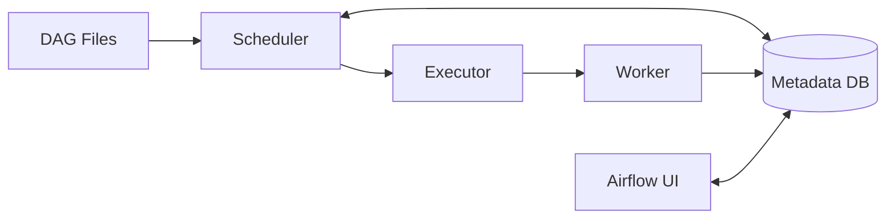

# Apache Airflow Architecture

## Overview

Apache Airflow is a workflow orchestration platform.

## Core Components

### Scheduler

The Scheduler determines which tasks are ready to run.

### Executor

The Executor determines how tasks are executed.

### Worker

Workers execute the actual task code.