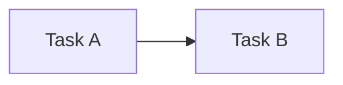
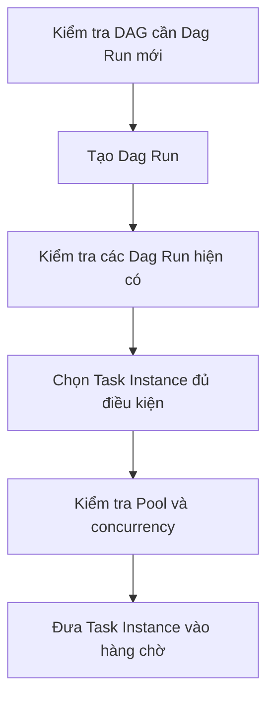
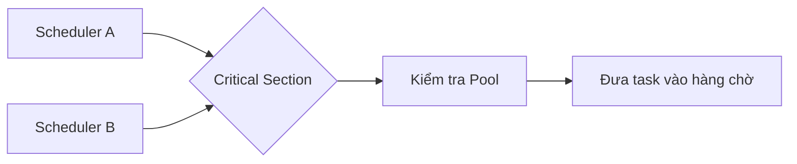

# Kiến trúc Apache Airflow

## Tại sao cần Airflow?

Bạn đã bao giờ tự hỏi tại sao chúng ta cần Airflow chưa? Nếu mục tiêu chỉ là điều phối các chương trình chạy tuần tự, một file Bash (`.sh`) hoàn toàn có thể đáp ứng. Khi cần chạy theo lịch, ta còn có thể kết hợp Bash với Cron.

### Điều phối tuần tự bằng Bash

Ví dụ, file `pipeline.sh` dưới đây lần lượt chạy hai task:

```bash
#!/usr/bin/env bash
set -e

echo "Bắt đầu task 1"
python3 /path/to/task_1.py

echo "Task 1 xong, bắt đầu task 2"
python3 /path/to/task_2.py

echo "Pipeline hoàn tất"
```

Cấp quyền thực thi cho file:

```bash
chmod +x /path/to/pipeline.sh
```

Sau đó, mở cấu hình Cron:

```bash
crontab -e
```

Thêm lịch chạy pipeline vào 02:00 mỗi ngày:

```cron
0 2 * * * /path/to/pipeline.sh >> /path/to/pipeline.log 2>&1
```

### Vì sao không chỉ dùng Bash?

Liệu chúng ta có thể thay Airflow bằng các file Bash như trên để tiết kiệm tài nguyên không? Câu trả lời là **không**.

Bash phù hợp khi hệ thống chỉ có một vài luồng xử lý cơ bản và dependency chưa quá phức tạp. Tuy nhiên, khi workflow phát triển lên hàng trăm task, các dependency cũng trở nên khó quản lý hơn. Giả sử pipeline đã hoàn thành 99% nhưng task cuối cùng bị lỗi: với Bash, bạn phải tự viết checkpoint, tách task thành những script riêng hoặc bổ sung cơ chế retry cho task đó.

Bash không cung cấp sẵn cơ chế retry/rerun theo từng task, khả năng lưu trạng thái hay giao diện vận hành. Nếu phải tự xây dựng tất cả những khả năng này, hệ thống sẽ nhanh chóng trở nên phức tạp.

### Airflow giải quyết điều gì?

Trong trường hợp này, Airflow trở thành một lựa chọn phù hợp với những khả năng như:

- UI giúp quan sát workflow trực quan hơn;
- retry cho từng task;
- lưu lại lịch sử chạy mà không phải tự xây dựng cấu hình phức tạp như khi dùng Bash;
- backfill để chạy lại một workflow trong quá khứ.

Airflow mang lại nhiều khả năng mạnh mẽ. Tuy nhiên, để khai thác tốt những khả năng đó, chúng ta cần hiểu rõ kiến trúc và cơ chế vận hành của nó. Bài viết này sẽ đi sâu vào Airflow, giúp bạn sử dụng công cụ một cách chủ động thay vì chỉ vận hành nó một cách mơ hồ.

---

## Những khái niệm nền tảng

Trước khi tìm hiểu kiến trúc Airflow, bạn cần nắm được năm khái niệm sau:

| Khái niệm | Ý nghĩa |
| --- | --- |
| **DAG** (`Directed Acyclic Graph`) | Trong tiếng Việt, DAG có nghĩa là **đồ thị có hướng không chu trình**. “Có hướng” nghĩa là mỗi cạnh biểu diễn quan hệ phụ thuộc theo một hướng, chẳng hạn `A → B`. “Không chu trình” nghĩa là không thể đi theo các cạnh rồi quay lại task ban đầu. |
| **Task** | Một nút trong DAG và là đơn vị công việc cơ bản của Airflow. Task thường được tạo từ `Operator`, `Sensor` hoặc một hàm được trang trí bằng `@task`. |
| **Task Instance** | Một task cụ thể trong một lần chạy DAG. Ví dụ, task A chạy ngày 21 là một Task Instance của ngày 21; khi chạy ngày 22, nó tạo ra một Task Instance khác. Scheduler chủ yếu làm việc với Task Instance thay vì định nghĩa Task. |
| **Schedule** | Cấu hình lịch chạy cho DAG. Khi đến thời điểm đã định, Airflow tự động kích hoạt DAG. Schedule có thể được cấu hình bằng Cron, các preset như `@daily` hoặc `timedelta`. |
| **Dependency** | Mối quan hệ giữa các task, đồng thời thể hiện điều kiện để task được chạy. Ví dụ, task A phải chạy trước task B. |

Ví dụ dependency đơn giản giữa hai task:



---

## Các component trong Airflow

### Các component bắt buộc

#### Scheduler

Scheduler theo dõi các DAG và Dag Run, tạo Dag Run theo lịch, xác định những Task Instance đã thỏa mãn dependency và các giới hạn concurrency, sau đó gửi chúng tới Executor để thực thi.

##### Quá trình phân tích DAG

Trong Airflow 2.x, Scheduler có một tiến trình con nội bộ tên là `DagFileProcessorManager`, được dùng để phân tích cú pháp các file trong DAG folder. Những tiến trình này ghi nhận trạng thái của file DAG vào metadata database; nếu quá trình phân tích gặp lỗi, thông tin lỗi sẽ được hiển thị trên UI.

Từ phiên bản 2.3, `DagFileProcessorManager` đã có thể được cấu hình để chạy độc lập. Từ Airflow 3, tiến trình này trở thành một component bắt buộc và luôn chạy tách biệt với Scheduler. Việc phân tách giúp tăng cường bảo mật, đồng thời hạn chế tình trạng quá trình parse các file DAG nặng làm nghẽn Scheduler.

> **Lưu ý về lịch `@daily`**
>
> Với lịch `@daily`, Dag Run xử lý data interval của ngày 1/1 thường được tạo sau khi khoảng dữ liệu đó kết thúc, tức là vào hoặc ngay sau 00:00 ngày 2/1 theo múi giờ của DAG. Cách vận hành này giúp khoảng dữ liệu cần xử lý được thu thập đầy đủ.

##### HA Scheduler

Khi hệ thống có quá nhiều DAG, với số lượng lên đến hàng trăm hoặc hàng nghìn task, một Scheduler có thể mất nhiều thời gian để hoàn thành một scheduling loop. Đây là lúc **HA Scheduler** trở nên hữu ích.

HA Scheduler cho phép chạy nhiều Scheduler cùng lúc. Tất cả Scheduler đều ở trạng thái active, thay vì một Scheduler active và một Scheduler pending. Mô hình này giúp chia tải điều phối; nếu một Scheduler gặp sự cố, những Scheduler còn lại có thể tiếp tục xử lý công việc.

Tuy nhiên, việc nhiều Scheduler chạy song song có thể dẫn tới xử lý trùng lặp. Chẳng hạn, Scheduler 1 và Scheduler 2 có thể cùng chọn một Dag Run để xử lý. Vì vậy, Airflow cần sử dụng cơ chế row-level lock của database.

Một scheduling loop gồm ba bước chính:

1. Kiểm tra DAG nào cần tạo Dag Run mới và tạo Dag Run tương ứng.
2. Kiểm tra các Dag Run hiện có để tìm Task Instance có thể bắt đầu được lập lịch, hoặc đánh dấu Dag Run đã hoàn tất.
3. Chọn các Task Instance đủ điều kiện để đưa vào lịch thực thi, đồng thời bảo đảm tuân theo giới hạn của Pool.



##### Critical Section

Trong scheduling loop có một bước được gọi là **Critical Section**. Tại một thời điểm, chỉ một Scheduler được phép đi vào khu vực này. Các Scheduler khác vẫn hoạt động và có thể tiếp tục thực hiện những phần khác của scheduling loop.

Critical Section kiểm tra Pool, xác định các task có thể thực thi và đưa chúng vào hàng chờ. Cơ chế này ngăn chặn tình huống:

1. Scheduler A thấy Pool còn hai slot và đưa hai task vào hàng chờ.
2. Scheduler B cũng thấy Pool còn hai slot và tiếp tục đưa thêm hai task vào hàng chờ.
3. Kết quả là có tổng cộng bốn task được xếp hàng, vượt quá giới hạn hai slot của Pool.



##### Khả năng mở rộng và nút thắt

Khi Scheduler bị giới hạn bởi CPU, việc thêm Scheduler thứ hai hoặc thứ ba thường giúp năng lực điều phối tăng gần tuyến tính. Tuy nhiên, mức tăng này không được bảo đảm nếu metadata database, mạng hoặc tài nguyên dùng chung đã trở thành nút thắt.

Một bottleneck phổ biến của Scheduler xuất hiện khi hệ thống có quá nhiều DAG và task. Scheduler phải liên tục truy cập database để lấy thông tin; nếu database không đủ khả năng đáp ứng, hiệu suất điều phối sẽ bị ảnh hưởng đáng kể.

#### Executor

Executor là một thuộc tính cấu hình của Scheduler, không phải một component tách rời. Executor chạy ngay bên trong tiến trình Scheduler.
