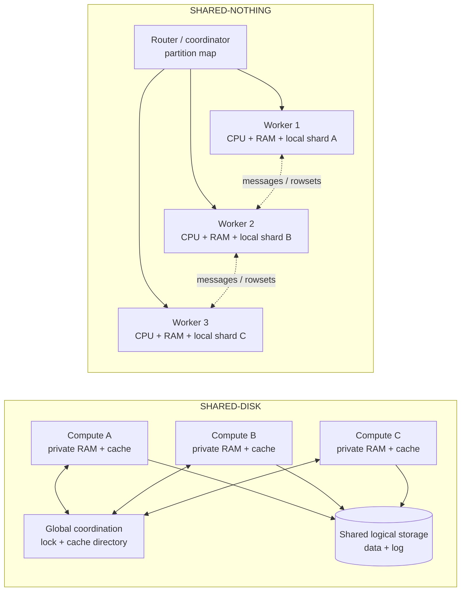
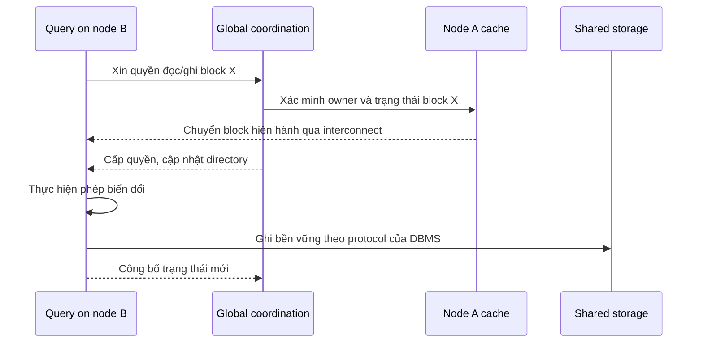
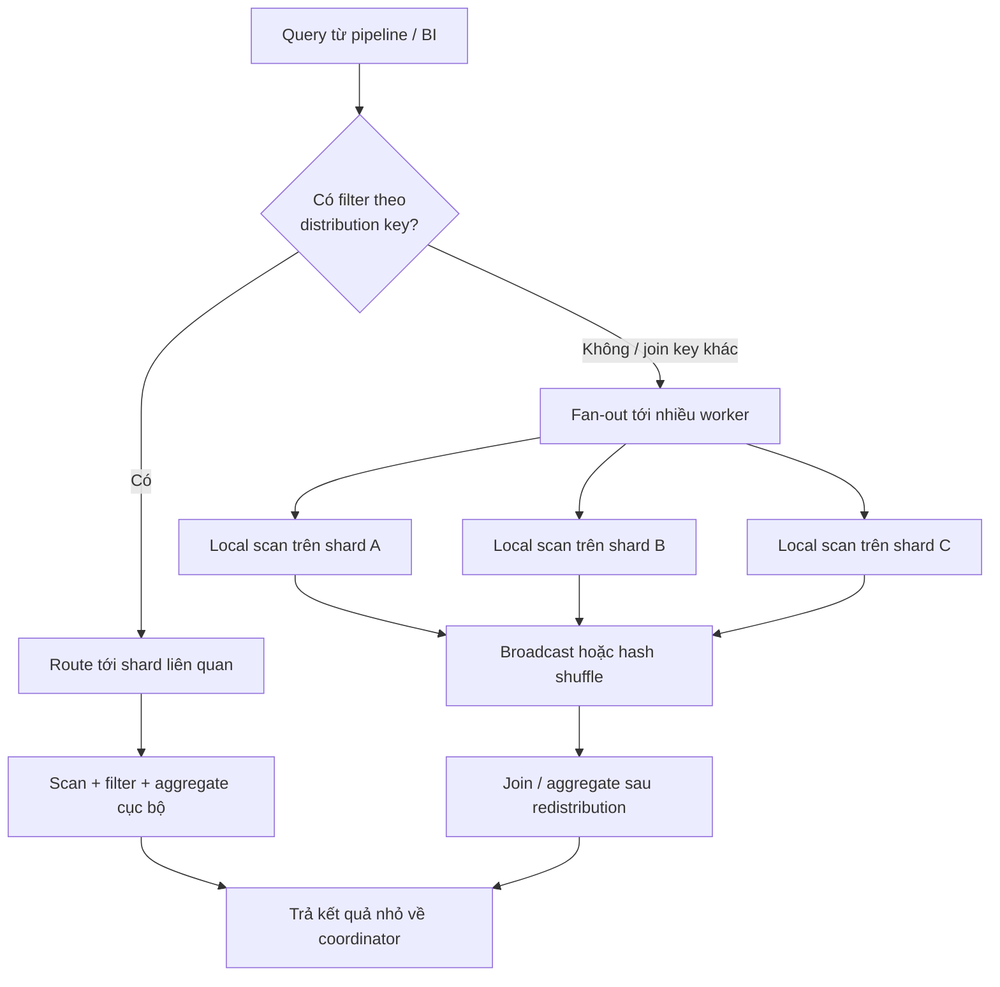
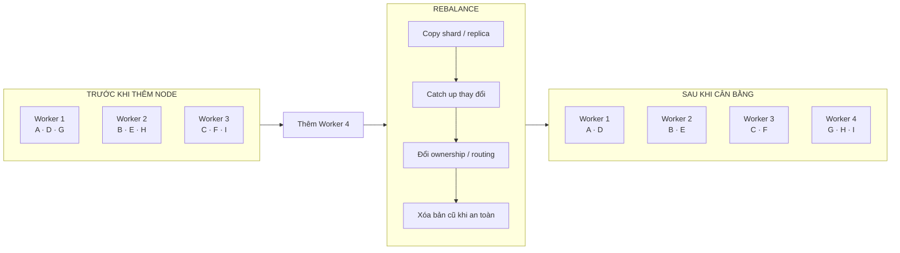
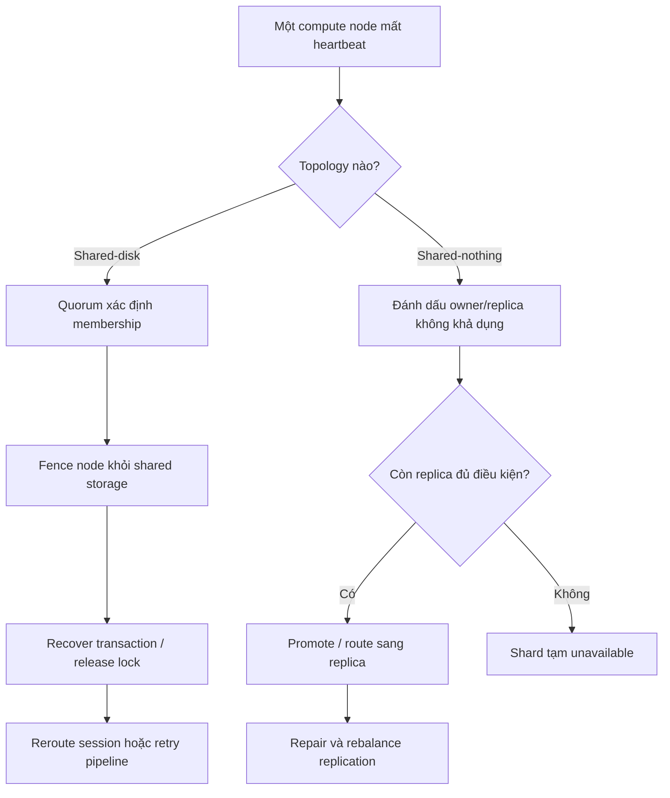
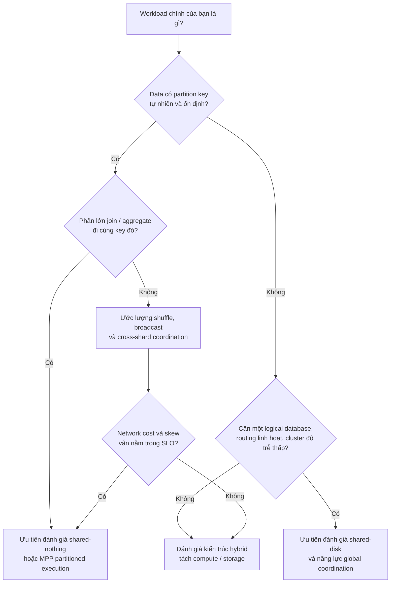

---
hide:
  - navigation
---

<header class="airflow-article-hero storage-article-hero">
  <div class="airflow-article-hero__eyebrow">
    <a href="../../">DATA ENGINEERING FIELD NOTES</a>
    <span>ARTICLE / 002</span>
  </div>
  <h1>Shared-disk<br><em>&amp; shared-nothing</em></h1>
  <p class="airflow-article-hero__dek">
    Hai cách đặt dữ liệu quyết định query chạy ở đâu, join có phải shuffle hay không,
    cluster mở rộng thế nào và Data Engineer cần quan sát điều gì khi pipeline chậm.
  </p>
  <div class="airflow-article-hero__meta" aria-label="Thông tin bài viết">
    <span>DATA ARCHITECTURE</span>
    <span>DEEP DIVE</span>
    <span>EDITION 02 · 2026</span>
  </div>
</header>

## Tại sao Data Engineer cần quan tâm?

Giả sử một pipeline cần join bảng `fact_orders` vài terabyte với `dim_customer`, sau đó aggregate doanh thu theo vùng. Câu SQL có thể giống hệt nhau trên nhiều hệ thống, nhưng data path phía dưới lại rất khác:

- một hệ thống cho mọi compute node đọc cùng tập dữ liệu trên shared storage;
- hệ thống khác đặt từng phần của bảng trên một worker cụ thể, rồi chỉ gửi message hoặc rowset qua mạng;
- một nền tảng cloud có thể lưu dữ liệu theo kiểu shared-disk nhưng xử lý query theo kiểu shared-nothing.

Sự khác biệt này quyết định việc thêm node có cần di chuyển dữ liệu không, join có chạy cục bộ hay phải **shuffle**, một distribution key lệch có làm cả batch chờ một worker hay không, và node hỏng có ảnh hưởng tới toàn bộ dataset hay chỉ một số shard.

> **Câu trả lời ngắn**
>
> **Shared-disk** chia sẻ persistent storage nhưng mỗi node có compute và memory/cache riêng. Nó giảm gánh nặng đặt từng shard lên từng node, đổi lại hệ thống phải phối hợp lock, cache và membership trên toàn cluster.
>
> **Shared-nothing** để mỗi node sở hữu compute, memory và storage cục bộ. Nó khai thác data locality và scale-out tốt khi workload đi cùng partition key, đổi lại Data Engineer phải quan tâm sâu hơn tới distribution, shuffle, skew, replication và rebalance.

Đây không phải cuộc thi tìm một kiến trúc thắng mọi workload. Đây là hai cách **đặt coordination cost ở hai vị trí khác nhau**.

---

## Bắt đầu từ câu hỏi: ai sở hữu dữ liệu?

Trong paper năm 1986, Michael Stonebraker định nghĩa **shared-disk** là nhiều processor có private memory nhưng dùng chung một tập disk; còn **shared-nothing** không chia sẻ memory lẫn persistent storage giữa các processor. Survey của DeWitt và Gray năm 1992 dùng cùng taxonomy và nhấn mạnh các node shared-nothing giao tiếp qua interconnect bằng message. Hai tài liệu này là nguồn gốc phù hợp để hiểu thuật ngữ, nhưng các kết luận hiệu năng lịch sử không nên được coi là benchmark cho phần cứng hiện tại ([Stonebraker, 1986](https://dsf.berkeley.edu/papers/hpts85-nothing.pdf); [DeWitt & Gray, 1992](https://people.csail.mit.edu/tdanford/6830papers/dewitt-gray-parallel-databases.pdf)).



Hai lưu ý giúp tránh phần lớn nhầm lẫn:

1. **“Nothing” không có nghĩa là không chia sẻ bất kỳ trạng thái logic nào.** Một shared-nothing cluster vẫn có network, metadata, coordinator, consensus hoặc catalog. Điều không được truy cập trực tiếp qua các node là RAM và local storage.
2. **“Có shared storage” chưa đủ để kết luận một database là shared-disk multi-active.** Một active-passive cluster hoặc một hệ thống chỉ có một writer vẫn có thể đặt file trên storage chung. Cần hỏi có bao nhiêu DBMS instance đồng thời đọc/ghi cùng logical database và chúng phối hợp cache/lock thế nào.

### Bốn khái niệm Data Engineer thường trộn lẫn

| Khái niệm | Nó quyết định điều gì? | Câu hỏi thực tế |
| --- | --- | --- |
| **Table partition** | Chia một bảng logic thành các phần, thường để pruning, retention và lifecycle | Query theo `event_date` có bỏ qua partition cũ không? |
| **Distribution / shard key** | Đặt row lên worker nào trong cluster | Hai bảng join có nằm cùng worker không? Key có phân phối đều không? |
| **Replication** | Tạo thêm bản sao để chịu lỗi hoặc đọc cục bộ | Node giữ primary hỏng thì replica nào tiếp quản? |
| **Clustering / sort order** | Sắp data gần nhau trong file, block hoặc micro-partition | Filter có giảm bytes/partitions scanned không? |

Tên gọi thay đổi theo sản phẩm. Điều quan trọng là lần theo **physical data placement** và **query execution path**, thay vì suy luận từ chữ “partition” trong UI.

---

## Shared-disk vận hành như thế nào?

Trong shared-disk database, các compute node nhìn thấy cùng một logical database trên storage. Mỗi node vẫn có buffer cache riêng để tránh đọc storage cho mọi request. Vấn đề xuất hiện khi node A và node B cùng giữ một block, nhưng một node muốn sửa nó: hệ thống phải biết bản nào hiện hành, ai được quyền ghi và cache nào cần invalidate hoặc cập nhật.

Oracle RAC minh họa cơ chế này bằng **Cache Fusion**. Tài liệu Oracle cho biết Global Cache Service (GCS), Global Enqueue Service (GES) và Global Resource Directory (GRD) phối hợp trạng thái block; block đang nằm trong cache của một instance có thể được chuyển trực tiếp qua private interconnect sang instance khác ([Oracle RAC documentation](https://docs.oracle.com/en/database/oracle/oracle-database/19/racad/introduction-to-oracle-rac.html)). IBM Db2 pureScale dùng một thiết kế khác: **Cluster Caching Facility** cung cấp global lock manager và group buffer pool, trong khi các member đều đọc/ghi cùng database trên shared disk ([IBM Db2 pureScale components](https://www.ibm.com/docs/en/db2/12.1.x?topic=environment-components-db2-purescale-feature)).



*Sơ đồ là mô hình khái niệm. Thứ tự log, page flush và recovery cụ thể phụ thuộc từng DBMS.*

### Điều Data Engineer nhận được

**Không cần chọn node sở hữu từng row.** Vì mọi instance có thể truy cập toàn bộ database, query routing và failover compute linh hoạt hơn. Khi thêm compute node, về nguyên tắc dataset hiện hữu không phải được hash lại chỉ để node mới nhìn thấy dữ liệu.

Điều này hữu ích khi workload khó partition theo một business key ổn định, nhiều query ad-hoc chạm các vùng dữ liệu khác nhau hoặc ứng dụng cần một logical database duy nhất mà không muốn đưa shard routing vào schema và pipeline.

### Chi phí bị đẩy xuống tầng cluster

Shared-disk không xóa coordination; nó **ẩn coordination khỏi data model** và thực hiện nó trong DBMS:

- global lock hoặc enqueue phải giữ concurrency đúng trên nhiều instance;
- cache coherence phải xử lý block hiện hành và bản cache cũ;
- interconnect mang lock message và có thể mang cả block;
- shared-storage path cần đủ bandwidth, latency và redundancy;
- membership, quorum và fencing phải ngăn hai nửa cluster cùng ghi sau network partition.

DeWitt và Gray chỉ ra rằng read/write trên cùng shared database tạo reservation message và page traffic; đó là nguyên lý cần nhớ, không phải lời khẳng định rằng mọi triển khai hiện đại scale giống nhau ([paper 1992](https://people.csail.mit.edu/tdanford/6830papers/dewitt-gray-parallel-databases.pdf)). Các kỹ thuật như Cache Fusion hoặc RDMA giảm một phần I/O/CPU, nhưng hot block và interconnect vẫn là những đường cần quan sát.

### Khi một node hỏng

Một compute node hỏng không làm các node còn lại mất quyền nhìn thấy data file. Tuy nhiên, cluster phải cô lập node hỏng, hoàn tất crash recovery cho transaction đang dang dở và giải phóng lock trước khi tiếp tục an toàn. Db2 pureScale mô tả rõ việc fence member hỏng, giữ tạm lock của dữ liệu in-flight và để các member sống tiếp tục phục vụ phần lớn dữ liệu ([IBM continuous availability](https://www.ibm.com/docs/en/db2/12.1.x?topic=environment-continuous-availability)).

> **Shared-disk không tự động đồng nghĩa với high availability.** Nếu shared logical storage, interconnect hoặc coordination service không có redundancy, “dùng chung” chỉ tạo ra một failure domain lớn hơn. Quorum, tiebreaker, multipath và I/O fencing là phần của thiết kế, không phải hệ quả tự nhiên của cái tên shared-disk ([IBM shared-storage support](https://www.ibm.com/docs/en/db2/12.1.x?topic=aix-shared-storage-support)).

---

## Shared-nothing vận hành như thế nào?

Trong shared-nothing database, data được chia thành shard, range hoặc partition. Mỗi phần có một owner hoặc một replica set; CPU, RAM và storage phục vụ phần dữ liệu đó nằm cục bộ trên worker. Router dùng partition map hoặc hàm hash để chuyển request tới đúng nơi.

Teradata là ví dụ cổ điển: mỗi AMP kiểm soát virtual disk space của riêng nó và mỗi row thuộc đúng một AMP ([Teradata AMP ownership](https://docs.teradata.com/r/Lake-Database-Reference/Database-Design/Database-Design-for-Vantage/Data-Placement-to-Support-Parallel-Processing/AMP-Ownership-of-Data)). Citus mô tả trực tiếp các PostgreSQL node phối hợp theo shared-nothing; distributed table được chia thành shard trên worker, còn coordinator giữ metadata để route hoặc parallelize query ([Citus 13 concepts](https://docs.citusdata.com/en/v13.0/get_started/concepts.html)).



### Vì sao MPP analytics thích locality?

Partitioned execution biến một scan lớn thành nhiều scan nhỏ chạy song song. Nếu filter, join và pre-aggregation được đẩy xuống worker đang giữ data, network chỉ mang kết quả đã thu gọn. DeWitt và Gray gọi partitioned data là chìa khóa của partitioned execution, đồng thời chỉ ra parallelism chỉ hiệu quả khi startup cost và skew không lấn át phần xử lý cục bộ ([DeWitt & Gray, 1992](https://people.csail.mit.edu/tdanford/6830papers/dewitt-gray-parallel-databases.pdf)).

Đây là lý do distribution key là một quyết định data modeling, không chỉ là tham số hạ tầng.

```sql
-- Ví dụ khái niệm; cú pháp DDL thay đổi theo sản phẩm.
fact_orders    DISTRIBUTED BY (customer_id)
dim_customer  DISTRIBUTED BY (customer_id)

SELECT c.region, SUM(o.amount)
FROM fact_orders AS o
JOIN dim_customer AS c USING (customer_id)
GROUP BY c.region;
```

Nếu hai bảng được colocate theo `customer_id`, mỗi worker có thể join phần local của nó rồi trả aggregate nhỏ. Nếu `fact_orders` phân phối theo `order_id` còn join theo `customer_id`, engine phải redistribute một hoặc cả hai phía. Citus ghi rõ repartition join cần shuffle data và colocated join thường hiệu quả hơn ([Citus repartition joins](https://docs.citusdata.com/_/downloads/en/v13.0/pdf/)).

### Distribution key tốt không chỉ là key “được filter nhiều”

Một key cần cân bằng nhiều mục tiêu:

- **Even distribution:** tránh một worker giữ quá nhiều row hoặc byte.
- **Execution balance:** tránh một giá trị nóng nhận phần lớn request.
- **Colocation:** giữ các row thường join hoặc aggregate cùng nhau trên một worker.
- **Cardinality:** có đủ giá trị để phân tán data, nhưng không phá locality cần thiết.
- **Stability:** không buộc đổi distribution thường xuyên khi access pattern thay đổi.

Trong một MPP query, thời gian hoàn tất thường bị quyết định bởi task chậm nhất. Greenplum mô tả trực tiếp rằng data skew khiến segment có nhiều data hơn làm việc lâu hơn, đồng thời join không cùng distribution column có thể cần redistribute hoặc broadcast row ([Greenplum distribution and skew](https://docs-cn.greenplum.org/v6/admin_guide/distribution.html)).

### Thêm node không có nghĩa data tự cân bằng

Node mới cung cấp CPU, RAM và disk trống. Các shard hiện hữu vẫn nằm trên owner cũ cho tới khi hệ thống **rebalance** chúng.



Data movement này dùng network và I/O, có thể tranh tài nguyên với backfill hoặc daily batch. Citus cũng lưu ý rằng sau khi thêm node, node mới chưa chứa shard hiện hữu; muốn dùng capacity mới cho data cũ phải chạy shard rebalancer ([Citus cluster management](https://docs.citusdata.com/_/downloads/en/v13.0/pdf/)). Vì vậy một kế hoạch scale-out cần trả lời cả **khi nào rebalance** và **giới hạn băng thông bao nhiêu**, không chỉ khi nào provision node.

### Replication là một trục riêng

Shared-nothing chỉ nói tài nguyên không được truy cập trực tiếp qua các node. Nó không đảm bảo data có bản sao. Một shard chỉ có một bản sẽ mất khả dụng khi owner hỏng; streaming replication, replica placement hoặc consensus mới tạo khả năng tiếp quản. Citus chẳng hạn dùng PostgreSQL streaming replication để chịu worker failure ([Citus node failures](https://docs.citusdata.com/_/downloads/en/v13.0/pdf/)).

Do đó, đừng đồng nhất:

- shared-nothing với eventual consistency;
- sharding với replication;
- nhiều worker với high availability;
- microservices với shared-nothing database.

---

## Cùng một workload, bottleneck nằm ở đâu?

| Tình huống | Shared-disk | Shared-nothing |
| --- | --- | --- |
| Scan fact table lớn | Nhiều compute có thể đọc cùng storage; storage bandwidth/cache là đường nóng | Mỗi worker scan shard cục bộ; hiệu quả khi shard và task cân bằng |
| Join hai bảng lớn | Không cần colocate theo node ownership, nhưng vẫn tốn CPU, memory và I/O | Colocated join rất tốt; non-colocated join cần broadcast/repartition/shuffle |
| Update cùng một key/block nóng | Global lock và cache-coherence traffic dễ tăng | Owner/leader của hot shard trở thành điểm nghẽn |
| Thêm compute node | Thường không cần di chuyển dataset chỉ để node đọc được | Cần rebalance shard/replica để capacity mới nhận data cũ |
| Compute node hỏng | Survivors vẫn nhìn thấy shared data; cần fencing và recovery | Shard bị ảnh hưởng cần replica/failover; partition map phải cập nhật |
| Storage hỏng | Shared path có blast radius lớn nếu không redundant | Failure thường cục bộ theo node, nhưng shard không replica vẫn mất |
| Scale đa vùng | Khó với protocol coherence nhạy latency | Có thể đặt replica/shard theo vùng, đổi lại transaction/consistency phức tạp hơn |

Điểm chung là **không kiến trúc nào xóa bottleneck**. Shared-disk tập trung áp lực vào shared storage và global coordination; shared-nothing phân tán tài nguyên nhưng đưa áp lực sang data placement, network exchange và node chậm nhất.

### Một failure flow Data Engineer nên hình dung



Ở tầng pipeline, retry vẫn phải đi cùng idempotency và checkpoint. Kiến trúc database có thể che một phần failover, nhưng không tự chứng minh rằng một `INSERT`, `MERGE` hoặc batch đã commit đúng một lần sau khi connection bị ngắt.

---

## Các hệ thống và công cụ Data Engineer thường gặp

| Hệ thống / công cụ | Cách đặt trong taxonomy | Điều nên nhìn vào |
| --- | --- | --- |
| **Oracle RAC** | Shared-disk theo taxonomy cổ điển; Oracle gọi là “shared everything” | Cache Fusion, GCS/GES/GRD, global-cache waits, interconnect và service routing |
| **IBM Db2 pureScale** | Shared-data/shared-disk multi-instance | Cluster Caching Facility, group buffer pool, global lock, fencing và tiebreaker |
| **Teradata Vantage** | Shared-nothing theo AMP ownership | Primary/distribution choice, AMP skew, redistribution và spool |
| **Greenplum** | MPP shared-nothing cho analytics | Distribution column, segment skew, broadcast/redistribute motion và spill |
| **Citus** | Shared-nothing PostgreSQL cluster | Shard placement, colocation group, repartition join, replication và rebalance |
| **Snowflake** | Hybrid: persisted data giống shared-disk, MPP compute giống shared-nothing | Partitions scanned, bytes sent over network, local/remote spill và warehouse load |

Snowflake là ví dụ hữu ích cho thế hệ cloud: tài liệu của hãng mô tả central repository cho persisted data, trong khi mỗi virtual warehouse là một compute cluster độc lập và các node xử lý một phần data cục bộ ([Snowflake architecture](https://docs.snowflake.com/en/user-guide/intro-key-concepts)). Vì vậy, “tách compute và storage” không khớp hoàn toàn với một nhãn cổ điển; hãy phân loại từng layer.

### Bộ metric thực dụng

Khi một ELT job chậm, hãy đọc execution plan trước khi tăng kích thước cluster:

| Nhóm tín hiệu | Cần kiểm tra |
| --- | --- |
| **Scan / pruning** | bytes scanned, partitions scanned/total, predicate có được push down không |
| **Distribution** | row/byte/task theo worker, max so với median, hot key hoặc hot partition |
| **Network** | bytes sent, broadcast/repartition step, thời gian chờ network |
| **Memory** | peak memory, local spill, remote spill, hash table hoặc sort quá lớn |
| **Coordination** | global lock/cache wait ở shared-disk; distributed transaction/commit wait ở shared-nothing |
| **Elasticity** | rebalance backlog, bytes đang move, replication lag, pipeline overlap với maintenance |
| **Failure** | retry count, failover event, under-replicated shard, fencing/recovery duration |

Snowflake Query Profile là một ví dụ cụ thể cho bộ tín hiệu này: nó hiển thị partitions scanned, bytes sent over network, bytes spilled ra local/remote storage và phần thời gian dành cho network/synchronization ([Snowflake Query Profile](https://docs.snowflake.com/en/user-guide/ui-snowsight-activity)). Trên hệ thống khác, tên view và metric thay đổi nhưng câu hỏi chẩn đoán vẫn giống nhau.

---

## Chọn kiến trúc nào cho data platform?



### Shared-disk đáng cân nhắc khi

- cần một logical database multi-instance và muốn tránh shard routing trong schema/pipeline;
- workload thay đổi khó dự đoán, nhiều query chạm những vùng data khác nhau;
- cluster chạy trong failure domain gần, interconnect có latency thấp;
- ưu tiên failover compute và workload balancing mà không di chuyển toàn bộ dataset.

### Shared-nothing đáng cân nhắc khi

- dataset và scan/aggregate cần scale-out trên nhiều worker;
- có distribution key giúp data và workload tương đối đều;
- phần lớn transformation có thể chạy local hoặc tạo kết quả trung gian nhỏ;
- team chấp nhận thiết kế colocation, replication, rebalance và distributed observability.

### Hybrid đáng cân nhắc khi

- muốn scale compute độc lập với persistent storage;
- có nhiều workload cần isolation hoặc elasticity khác nhau trên cùng dataset;
- chấp nhận engine quản lý cache, metadata và data movement phía sau abstraction cloud.

Không nên chọn chỉ từ tên kiến trúc. Hãy lấy 5–10 query quan trọng nhất, vẽ data path của chúng, đo bytes scan/shuffle/spill, mô phỏng mất node và thử một lần scale-out có rebalance. Kiến trúc phù hợp là kiến trúc giữ được SLO trong những đường đi đó với độ phức tạp vận hành mà team có thể sở hữu.

---

## Checklist cho Data Engineer

Trước khi đưa một workload lên production, hãy trả lời được:

1. Row của mỗi bảng được đặt ở đâu, theo key nào và có replica ở đâu?
2. Table partition, distribution key và sort/clustering key đang phục vụ ba mục tiêu khác nhau nào?
3. Ba join tốn kém nhất là local, broadcast hay repartition?
4. Max worker runtime/bytes lệch bao nhiêu so với median?
5. Thêm node có kích hoạt rebalance không, và rebalance cạnh tranh với batch window thế nào?
6. Node hoặc network partition xảy ra thì ai được quyền tiếp tục ghi?
7. Pipeline retry dựa vào checkpoint/idempotency nào khi kết quả commit không rõ ràng?
8. Dashboard có scan, shuffle/network, spill, skew, replication lag và recovery event chưa?

Nếu chưa trả lời được những câu này, vấn đề không nằm ở việc bạn chưa nhớ định nghĩa shared-disk hay shared-nothing. Vấn đề là physical data path của hệ thống vẫn còn là một chiếc hộp đen.

---

## Kết luận

Với Data Engineer, **shared-disk** và **shared-nothing** là bản đồ để lần theo query và data movement:

- shared-disk cho nhiều compute node nhìn cùng persistent data, đơn giản hóa placement ở tầng người dùng nhưng cần global coordination;
- shared-nothing đặt data vào shard do node sở hữu, mở rộng parallel execution nhưng khiến distribution, locality, skew và rebalance trở thành phần của data design;
- nền tảng cloud thường ghép cả hai, nên phải phân loại theo storage layer, compute layer và write path riêng biệt.

Khi một pipeline chậm, câu hỏi hữu ích nhất không phải “hệ thống này thuộc trường phái nào?”, mà là: **data đang ở đâu, bước nào phải đi qua network, và tài nguyên nào đang buộc tất cả worker còn lại phải chờ?**

## Tài liệu tham khảo

- Michael Stonebraker, *[The Case for Shared Nothing](https://dsf.berkeley.edu/papers/hpts85-nothing.pdf)*, IEEE Database Engineering Bulletin 9(1), 1986.
- David J. DeWitt và Jim Gray, *[Parallel Database Systems: The Future of High Performance Database Systems](https://people.csail.mit.edu/tdanford/6830papers/dewitt-gray-parallel-databases.pdf)*, Communications of the ACM 35(6), 1992.
- Oracle, *[Introduction to Oracle RAC](https://docs.oracle.com/en/database/oracle/oracle-database/19/racad/introduction-to-oracle-rac.html)*, Oracle Database 19c documentation, truy cập ngày 29/08/2026.
- IBM, *[Components of the Db2 pureScale Feature](https://www.ibm.com/docs/en/db2/12.1.x?topic=environment-components-db2-purescale-feature)* và *[Continuous availability](https://www.ibm.com/docs/en/db2/12.1.x?topic=environment-continuous-availability)*, Db2 12.1 documentation, truy cập ngày 29/08/2026.
- Teradata, *[AMP Ownership of Data](https://docs.teradata.com/r/Lake-Database-Reference/Database-Design/Database-Design-for-Vantage/Data-Placement-to-Support-Parallel-Processing/AMP-Ownership-of-Data)*, VantageCloud Lake Database Reference, 2025.
- Citus Data, *[Citus Documentation 13.0.1](https://docs.citusdata.com/_/downloads/en/v13.0/pdf/)*, truy cập ngày 29/08/2026.
- Greenplum, *[Distribution and Skew](https://docs-cn.greenplum.org/v6/admin_guide/distribution.html)*, Greenplum Database v6 documentation, truy cập ngày 29/08/2026.
- Snowflake, *[Key concepts and architecture](https://docs.snowflake.com/en/user-guide/intro-key-concepts)* và *[Query Profile reference](https://docs.snowflake.com/en/user-guide/ui-snowsight-activity)*, truy cập ngày 29/08/2026.

<footer class="airflow-article-end storage-article-end">
  <div>
    <span>Cảm ơn bạn vì đã đọc / 002</span>
    <strong>Đặt data đúng chỗ,<br>giảm coordination đúng nơi.</strong>
  </div>
  <a href="../../">Trở về thư viện <span aria-hidden="true">→</span></a>
</footer>
