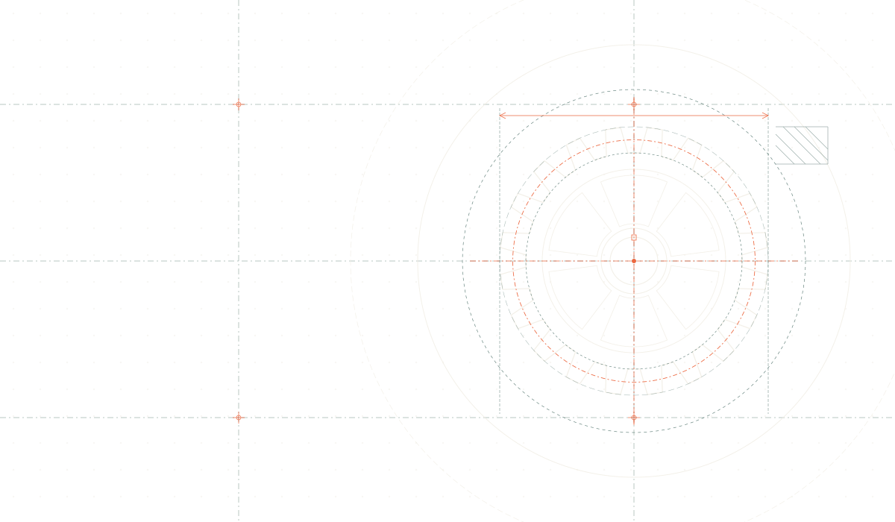

---
hide:
  - navigation
  - toc
---

  <section class="landing-hero" aria-labelledby="landing-title">
    

      
    

    

      

        
        Data Engineering Field Notes
        <small>Est. 2026</small>
      

      <h1 id="landing-title">Một bản đồ sống cho thế giới <em>Data Engineering.</em></h1>
      

        Tập hợp những bài viết đi từ <strong>lý do một công cụ tồn tại</strong>
        đến cách nó vận hành bên trong — để chúng ta không chỉ biết dùng tool,
        mà còn biết mình đang xây điều gì.
      

      

        <a class="landing-button landing-button--primary" href="#thu-vien">
          Chọn bài để đọc ↘
        </a>
      

      

        ✦ Viết bằng tiếng Việt · Cập nhật theo hành trình học và làm
      

    

    

      

        Những bài viết nên đọc
        <svg viewBox="0 0 180 220" role="presentation">
          <path d="M5 12C55 5 78 20 84 49C92 88 108 143 157 177"></path>
          <path d="M151 165L160 179L144 182"></path>
        </svg>
      

      

        

          FIELD MAP / 001
          <i></i> ONGOING
        

        

          

            <article class="article-sheet article-sheet--airflow" data-article-title="Kiến trúc Apache Airflow" data-deck-position="current">
              
ORCHESTRATION<b>01 / 06</b>

              

                Đã xuất bản
                <h2>Hiểu kiến trúc Apache Airflow</h2>
                
Từ nhu cầu điều phối đến Scheduler, Executor và High Availability.

              

              

                11 phút đọc
                <a href="airflow/architecture/">Mở bài viết <b aria-hidden="true">↗</b></a>
              

            </article>

            <article class="article-sheet article-sheet--storage" data-article-title="Shared-disk vs shared-nothing" data-deck-position="next">
              
DATA ARCHITECTURE<b>02 / 06</b>

              

                Bài mới nhất
                <h2>Shared-disk vs shared-nothing</h2>
                
Chọn topology dữ liệu từ góc nhìn Data Engineer: query, shuffle và failure.

              

              

                Deep research
                <a href="architecture/shared-disk-vs-shared-nothing/">Mở bài viết <b aria-hidden="true">↗</b></a>
              

            </article>

            <article class="article-sheet article-sheet--planned" data-article-title="Apache Spark internals" data-deck-position="back">
              
PROCESSING<b>03 / 06</b>

              

                Trong lộ trình
                <h2>Apache Spark internals</h2>
                
Partition, DAG execution, shuffle và cách một job thật sự chạy qua cluster.

              

              
Dự kiến<em>Đang lên dàn ý</em>

            </article>

            <article class="article-sheet article-sheet--planned article-sheet--clay" data-article-title="Apache Kafka internals" data-deck-position="hidden">
              
STREAMING<b>04 / 06</b>

              

                Trong lộ trình
                <h2>Apache Kafka internals</h2>
                
Log phân tán, partition ownership và những đánh đổi của delivery semantics.

              

              
Dự kiến<em>Chờ nghiên cứu</em>

            </article>

            <article class="article-sheet article-sheet--planned article-sheet--blue" data-article-title="dbt: từ SQL đến lineage" data-deck-position="hidden">
              
TRANSFORMATION<b>05 / 06</b>

              

                Trong lộ trình
                <h2>dbt: từ SQL đến lineage</h2>
                
Compiler, materialization và cách tổ chức transformation thành sản phẩm dữ liệu.

              

              
Dự kiến<em>Chờ nghiên cứu</em>

            </article>

            <article class="article-sheet article-sheet--planned article-sheet--ink" data-article-title="Docker và Kubernetes cho Data Engineer" data-deck-position="hidden">
              
INFRASTRUCTURE<b>06 / 06</b>

              

                Trong lộ trình
                <h2>Docker &amp; Kubernetes cho Data Engineer</h2>
                
Từ một container đến workload dữ liệu có thể deploy, quan sát và phục hồi.

              

              
Dự kiến<em>Chờ nghiên cứu</em>

            </article>
          

          

            <i></i>
            
<b>Kéo sang trái</b> để lật bài

          

          

        

        

          <b>02</b> bài đã mở
          <b>04</b> bài sắp tới
          <b>01</b> / 06
        

      

      
      
    

  </section>

  <section class="library-section" id="thu-vien" aria-labelledby="library-title">
    

      

        
THE KNOWLEDGE SHELF / 01

        <h2 id="library-title">Hôm nay bạn muốn tìm hiểu điều gì?</h2>
      

    

    

      

        
      

      

        
DANH MỤC BÀI VIẾT

        <button class="tool-choice tool-choice--active" type="button" data-preview="airflow" aria-pressed="true">
          01
          
            <small>ORCHESTRATION</small>
            <strong>Apache Airflow</strong>
          
          Đang chọn
        </button>

        <button class="tool-choice" type="button" data-preview="storage" aria-pressed="false">
          02
          
            <small>DATA ARCHITECTURE</small>
            <strong>Shared-disk vs shared-nothing</strong>
          
          Đã mở
        </button>

        <button class="tool-choice tool-choice--soon" type="button" data-preview="spark">
          03
          <small>PROCESSING</small><strong>Apache Spark</strong>
          Sắp tới
        </button>

        <button class="tool-choice tool-choice--soon" type="button" data-preview="kafka">
          04
          <small>STREAMING</small><strong>Apache Kafka</strong>
          Sắp tới
        </button>

        <button class="tool-choice tool-choice--soon" type="button" data-preview="dbt">
          05
          <small>TRANSFORMATION</small><strong>dbt</strong>
          Sắp tới
        </button>

        <button class="tool-choice tool-choice--soon" type="button" data-preview="infrastructure">
          06
          <small>INFRASTRUCTURE</small><strong>Docker &amp; Kubernetes</strong>
          Sắp tới
        </button>
      

      <article class="featured-article" id="featured-article" data-preview-number="01" data-preview-label="FEATURED / 01">
        <header class="featured-article__header">
          

            <small>FIELD NOTE</small><b id="featured-stamp-number">01</b>
          

          

            
APACHE AIRFLOW · LONG READ

            Đã xuất bản · 01 bài
          

          ED. 01
        </header>

        

          
BÀI VIẾT NỔI BẬT

          <h3 id="featured-title">Hiểu kiến trúc Airflow từ nhu cầu điều phối.</h3>
          

            Bắt đầu với một pipeline Bash và Cron, rồi lần lượt mở từng lớp của
            Airflow: DAG, Task, Scheduler, Executor, HA và Critical Section.
          

          

            ArchitectureSchedulerExecutorHigh Availability
          

          <a class="article-read-button" id="featured-read-button" href="airflow/architecture/">
            Đọc toàn bộ bài viết<b aria-hidden="true">↗</b>
          </a>
        

        

          
ĐỌC THEO LỘ TRÌNH

          

            <a href="airflow/architecture/#tai-sao-can-airflow">CHƯƠNG 01<strong>Tại sao cần Airflow?</strong><b aria-hidden="true">↗</b></a>
            <a href="airflow/architecture/#nhung-khai-niem-nen-tang">CHƯƠNG 02<strong>Khái niệm nền tảng</strong><b aria-hidden="true">↗</b></a>
            <a href="airflow/architecture/#cac-component-trong-airflow">CHƯƠNG 03<strong>Kiến trúc bên trong</strong><b aria-hidden="true">↗</b></a>
          

        

      </article>
    

  </section>

  <section class="writing-section" id="cach-viet" aria-labelledby="writing-title">
    

      
    

    

      

        

          
          
HOW THESE NOTES ARE MADE / 02

        

        <h2 id="writing-title">Không học thuộc tool. <em>Học cách nó suy nghĩ.</em></h2>
      

      

        QUY TRÌNH BIÊN SOẠN · 3 GIAI ĐOẠN
        

          Mỗi bài viết được xây như một cuộc điều tra nhỏ: bắt đầu bằng câu hỏi
          “vì sao”, đi vào phần lõi, rồi quay lại với quyết định trong thực tế.
        

      

    

    

      
SOURCE<i></i>

      

      
01 · PROBLEM<i></i>

      

      
02 · INTERNALS<i></i>

      

      
03 · TRADE-OFF<i></i>

      

      
PRODUCTION<i></i>

    

    

      <article class="writing-card" data-step-number="01" role="listitem">
        <header class="writing-card__header">
          

            <small>BƯỚC</small><b>01</b>
          

          

            ORIGIN / NGUYÊN DO
          

        </header>

        

          PROBLEM
        

        <h3 class="writing-card__title">Bắt đầu từ vấn đề</h3>
        
“Tại sao giải pháp này cần phải ra đời?”

        

          Trước mỗi component luôn là một bài toán thực tế: điểm nghẽn cổ chai,
          giới hạn mở rộng hoặc sự sụp đổ của những cách tiếp cận cũ.
        

        <footer class="writing-card__tags" aria-label="Khía cạnh phân tích">
          Root Problem
          Why it exists
          Failure Modes
        </footer>
      </article>

      <article class="writing-card" data-step-number="02" role="listitem">
        <header class="writing-card__header">
          

            <small>BƯỚC</small><b>02</b>
          

          

            INTERNALS / BÊN TRONG
          

        </header>

        

          CORE MECHANISM
        

        <h3 class="writing-card__title">Mở chiếc hộp đen</h3>
        
“Bên dưới nắp máy thật sự vận hành ra sao?”

        

          Bóc tách từng tầng kiến trúc, luồng dữ liệu (data flow) và trạng thái
          phân tán, thay vì dừng lại ở các câu lệnh cấu hình bề mặt.
        

        <footer class="writing-card__tags" aria-label="Khía cạnh phân tích">
          Architecture
          Data Flow
          State &amp; Locks
        </footer>
      </article>

      <article class="writing-card" data-step-number="03" role="listitem">
        <header class="writing-card__header">
          

            <small>BƯỚC</small><b>03</b>
          

          

            SYNTHESIS / THỰC CHIẾN
          

        </header>

        

          PRODUCTION
        

        <h3 class="writing-card__title">Nối lại với thực tế</h3>
        
“Đánh đổi điều gì khi đưa vào vận hành?”

        

          Hiểu rõ giới hạn chịu tải, chi phí vận hành và ranh giới phù hợp để
          đưa ra quyết định kiến trúc chuẩn xác cho hệ thống thực tế.
        

        <footer class="writing-card__tags" aria-label="Khía cạnh phân tích">
          Trade-offs
          Failure Modes
          Production Limits
        </footer>
      </article>
    

    
  </section>

  <section class="author-section" id="nguoi-viet" aria-labelledby="author-title">
    

      
    

    

      
PERSONAL LOG / 001

      PEOPLE BEHIND THE NOTES
    

    

      TOGETHER
      <figure class="author-photo">
        

          
        

        <figcaption>OFFLINE / PHAN THIET© 28.08.2026</figcaption>
      </figure>

      

        
A NOTE FROM THE AUTHOR / ĐÔI LỜI

        <h2 id="author-title">Chào bạn, cảm ơn vì đã ghé qua.</h2>
        

          AUTHOR'S PRINCIPLE / 01
          Mình tin rằng <strong>hiểu sâu</strong> một công cụ là cách tốt nhất để dùng nó đơn giản hơn.
        

        

          

            Trang này bắt đầu từ một nhu cầu rất đơn giản: mình muốn lưu lại những
            lần phải đào sâu để hiểu một công cụ thực sự vận hành ra sao — không
            chỉ là vài câu lệnh đủ để nó chạy.
          

          

            Kiến thức <strong class="author-keyword">Data Engineering</strong> thường nằm rải rác giữa documentation,
            source code và những lần hệ thống gặp sự cố. Mình gom chúng lại ở đây,
            bằng thứ ngôn ngữ mà chính mình cũng muốn đọc khi mới bắt đầu.
          

          

            Thư viện bắt đầu với <strong class="author-keyword">Airflow</strong> và các nền tảng kiến trúc dữ liệu. Mình hy vọng
            mỗi lần quay lại, bạn sẽ tìm thấy thêm một mảnh ghép hữu ích cho hệ thống
            mà bạn đang xây.
          

        

        

          Author
          
<strong>Phong Thanh</strong><small>Học, làm, rồi ghi lại.</small>

        

      

    

    <article class="coauthor-card" aria-labelledby="coauthor-title">
      

        

          COLLABORATOR FILE<b>02</b>
        

        
A SECOND POINT OF VIEW / ĐỒNG TÁC GIẢ

        <h3 id="coauthor-title">Thêm một góc nhìn, thêm một lớp rõ ràng.</h3>
        

          CO-AUTHOR'S PRINCIPLE / 02
          Một ghi chú tốt không chỉ cần được <strong>viết kỹ</strong> — nó còn cần một người
          sẵn sàng hỏi lại những điều tưởng như đã hiển nhiên.
        

        

          Danh đồng hành cùng Field Notes trong vai trò đồng tác giả: trao đổi
          <strong class="author-keyword">hướng tiếp cận</strong>, rà lại mạch giải thích và giúp mỗi bài viết gần hơn
          với <strong class="author-keyword">trải nghiệm của người đọc</strong>.
        

        

          Co-author
          
<strong>Danh</strong><small>Cùng đọc, cùng chất vấn, cùng hoàn thiện.</small>

        

      

      <figure class="coauthor-card__photo">
        

          
          02
        

        <figcaption>CO-AUTHOR PORTRAITFIELD NOTES / 2026</figcaption>
      </figure>
    </article>
  </section>

  <footer class="landing-footer">
    
DATA ENGINEERING FIELD NOTES

    
Built slowly. Understood deeply.

    <a href="#landing-title">Lên đầu trang ↑</a>
  </footer>

